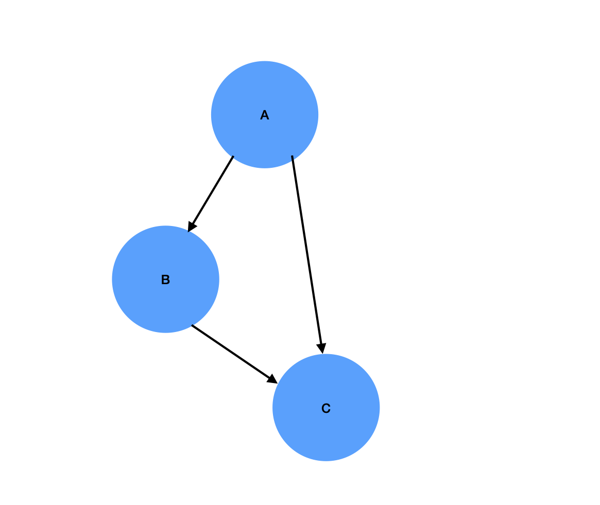

# pod-target

Find dependencies between targets in your pod project, and output the csv file which shows dependencies that can be removed from podspec of the target.

X->Y means X depends on Y

Like the image above, we have: A->B->C and A->C. We will output the file csv named "remove_dependency.csv" to show the targets that can be removed from A. For this example, it will be like this:
A,C. The first column is the target, and the following targets are targets can be removed.

Moreover, we also draw dependency graph for specific target based on this idea. We remove all dependencies lika A->C, so we can see dependencie between targets clearer.
## Installation

Add this line to your application's Gemfile:

```ruby
gem 'pod-target'
```

And then execute:

    $ bundle install

Or install it yourself as:

    $ gem install pod-target

## Usage
pod-target resolve-dependency\

Options:\
      [--workspace=WORKSPACE]  # Set workspace path, if not set will use current directory\
      \
      [--output=OUTPUT]        # Set output path of csv file, if not set will use current directory\
      \
      [--filter=expression]    # If set, filter targets which name matches the regular expression\

Workspace path and output path can be absolute path or relative path

pod-target target\

Options:\
  [--root=ROOT]            # Set name of the root target, must be set
  \
  [--workspace=WORKSPACE]  # Set workspace path, if not set will use current directory
  \
  [--output=OUTPUT]        # Set output path of csv file, if not set will use current directory
## Development

After checking out the repo, run `bin/setup` to install dependencies. Then, run `rake spec` to run the tests. You can also run `bin/console` for an interactive prompt that will allow you to experiment.

To install this gem onto your local machine, run `bundle exec rake install`. To release a new version, update the version number in `version.rb`, and then run `bundle exec rake release`, which will create a git tag for the version, push git commits and tags, and push the `.gem` file to [rubygems.org](https://rubygems.org).

## Contributing

Bug reports and pull requests are welcome on GitHub at https://github.com/bendoppler/podspec-dependency-resolve This project is intended to be a safe, welcoming space for collaboration, and contributors are expected to adhere to the [code of conduct](https://github.com/bendoppler/podspec-dependency-resolve/blob/master/CODE_OF_CONDUCT.md).


## Code of Conduct

Everyone interacting in the pod-target project's codebases, issue trackers, chat rooms and mailing lists is expected to follow the [code of conduct](https://github.com/bendoppler/podspec-dependency-resolve/blob/master/CODE_OF_CONDUCT.md).

## Copyright

Copyright (c) 2021 Bao Do. See [MIT License](LICENSE.txt) for further details.